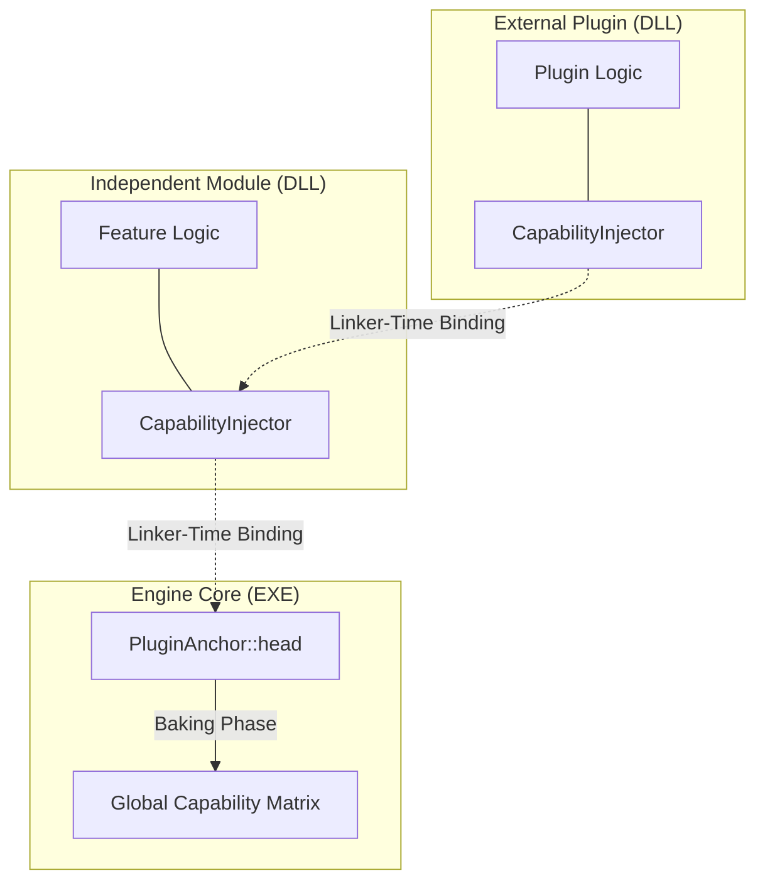

# Capability Routing Gateway (CRG)
**Linker-Driven Architecture for Decoupled Module Discovery and High-Performance Dispatch**

[Technical White Paper](paper/paper.md) | [Launch Interactive Simulator](https://ct-74.github.io/CapabilityReconstructionGraph/demo/final_simulator/index.html) | [Tensor Visualizer](https://ct-74.github.io/CapabilityReconstructionGraph/img/tensor_visualizer.html)

## Overview
CRG is a compile-time architectural framework designed to eliminate hard dependencies between engine modules. While it enables high-performance Data-Oriented Polymorphism, its core value lies in its **Zero-Dependency Injection** mechanism. It allows disparate systems (AI, Physics, Gameplay) to register and discover capabilities at the linker level, removing the need for centralized registries, "Include Hell," and bloated build times.

## Linker-Driven Discovery (Pillar I)
This is a standalone mechanism for module isolation. The engine core requires no knowledge of external features. Modules "inject" themselves via a **Linker-Driven Registry** using a **Strict Anchor** pattern. This ensures that the linker resolves behavioral chains across DLL/Binary boundaries without the fragility of manual registration or standard static initialization.

## Performance: Saturating the Memory Wall
When used for data-oriented dispatch, the CRG architecture shifts the bottleneck from software indirection to physical memory limits. By maintaining **Structural Immunity** (zero entity migration), the system saturates available bus bandwidth on Apple M-Series hardware.

| Dataset Size | Implementation | Execution Time | Throughput | Overhead vs CRG |
| :--- | :--- | :--- | :--- | :--- |
| **64k (Cache-bound)** | ECS Mutation | 887,026 ns | 35.23 Gi/s | **1.99x** |
| | **CRG Routing** | **444,965 ns** | **70.23 Gi/s** | **Baseline** |
| **1M (Memory-bound)** | ECS Mutation | 25,956,111 ns | 19.26 Gi/s | **1.60x** |
| | **CRG Routing** | **16,220,465 ns** | **30.83 Gi/s** | **Baseline** |

---

**Implementation Note:** *The provided source code is a **reference implementation** focused on architectural clarity and portability. To maintain a clean-room approach and ensure readability, certain hardware-specific optimizations (such as manual SBO memory management) have been replaced by standard C++ constructs (e.g., `std::unique_ptr`). In a production environment, these should be replaced by the hardware-aligned structures described in the white paper.*

**Author:** Cyril Tissier  
**License:** Apache 2.0  

**Legal Disclaimer:** *This repository represents independent research and a clean-room implementation of the Capability Routing Gateway architecture. All code and documentation were developed personally by the author. This project is independent of, and does not contain any proprietary or confidential information from, any past or present employer.*