# SLIDE: 00 - THE HOOK (Hardware-Software Symmetry)
## Code
```cpp
// Hardware Reality: Physical Separation
// L1 Instruction Cache (L1I)  <==>  Stateless Behaviors
// L1 Data Cache (L1D)         <==>  Pure Data Models

// The Software Conflict:
struct TraditionalObject {
    void Behavior(); // L1I
    float Data;      // L1D
}; // Forces coupling where hardware demands split.
```
## Mermaid
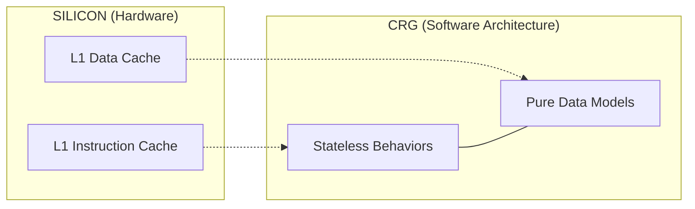
## EN
If you look at the silicon of a modern CPU, the Level 1 cache is physically divided in two: the Data Cache (L1D) and the Instruction Cache (L1I). The hardware itself demands a strict separation between state and behavior to reach peak efficiency. Yet, for decades, we have forced them together in our objects. Stateless Behavior Projection is the answer. We stop fighting the hardware. We treat data and logic as two parallel dimensions — mirroring the silicon itself.
## FR
Si vous regardez le silicium d'un processeur moderne, le cache de niveau 1 est physiquement divisé en deux : le cache de données (L1D) et le cache d'instructions (L1I). Le matériel lui-même exige une séparation stricte entre l'état et le comportement pour atteindre son efficacité maximale. Pourtant, pendant des décennies, nous les avons forcés ensemble dans nos objets. Le CRG est la réponse. On arrête de se battre contre le matériel. On traite la donnée et la logique comme deux dimensions parallèles — en miroir du silicium lui-même.

# SLIDE: 01 - THE COST OF COUPLING (The Build Wall)
## Code
```cpp
// You change this:
struct ConfigManager {
    bool b_EnableFeatureX = false; // ← one bool
};

// The compiler punishes everyone:
// config_manager.h -> service_layer.h -> data_pipeline.h -> ui_controller.h
// 217 files recompile. 38 minutes. Every programmer. Every day.
```
## Mermaid
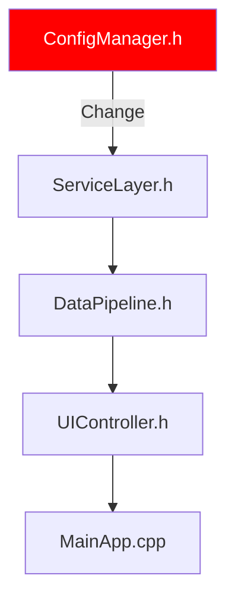
## EN
You touch a header. One bool. You hit build. 38 minutes later, you're still waiting. That's Include Hell. It doesn't feel like a performance problem; it feels like a morale problem. But it's an architecture problem. Everything is entangled at compile time. CRG cuts that knot: how do you get behaviors to discover each other at link time, with zero shared headers?
## FR
Vous touchez un header. Un seul bool. Vous lancez le build. Vous allez chercher un café. Vous revenez. Ça compile encore. Vous allez déjeuner. Ça finit pendant que vous mangez. 38 minutes. Pour un bool. C'est l'Include Hell. Et voilà le truc — ça ne ressemble pas à un problème de performance. Ça ressemble à un problème de moral. Un problème de communication. 'Qui a encore touché ConfigManager.h ?' Mais ce n'est pas ça. C'est un problème d'architecture. Tout est couplé au moment de la compilation. Le CRG résout ce problème. L'objectif de l'Acte I est simple : comment faire en sorte que les comportements se découvrent mutuellement au moment du link, sans aucun header partagé ?

# SLIDE: 02 - THE INTRUSIVE BACKBONE (NodeList + RegistrySlot)
## Code
```cpp
// RegistrySlot: Anchored definition in engine core
#define CRG_BIND_SLOT(T) template<> T RegistrySlot<T>::s_Value{};
CRG_BIND_SLOT(const BehaviorNode*)

// MODULE A: Zero dependencies on core internals
struct DroneBehavior : NodeList<BehaviorNode, IBehavior> {
    void Execute() const override { /* ... */ }
};
static DroneBehavior g_drone; // OS loads DLL, constructor fires.
```
## Mermaid
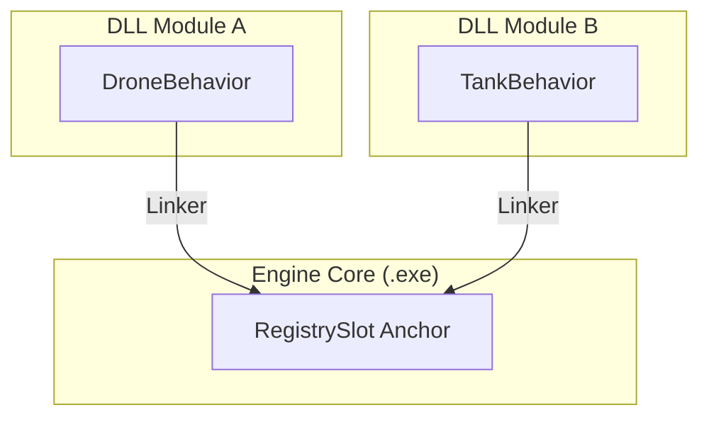
## EN
In production, you have modules registering capabilities without the core knowing they exist. CRG_BIND_SLOT anchors the registry in the core, allowing DLLs to resolve to a single address via the linker. Define a struct, instantiate it as a static, and the OS fires the constructor on load. It's a fully functional plugin system obtained for free.
## FR
En production, vous n'avez jamais un seul binaire. Vous avez le core, une DLL réseau, une DLL outils, une DLL robotique — et chacune doit pouvoir enregistrer ses capabilities sans que le core ait à la connaître. L'approche naïve, c'est le static inline partout. Mais en développement, on veut du hot-reload et des plugins. C'est là que le mode DLL entre en jeu. CRG_BIND_SLOT déplace la définition vers l'exécutable core — une spécialisation de template explicite que chaque DLL résout via le linker. L'API de découverte est identique : définissez une struct, instanciez-la en statique, et l'OS déclenche le constructeur au chargement. Aucun Init(), aucun registre central, aucun include du core. Vous déposez un fichier dans une DLL. Il s'enregistre lui-même. C'est tout.

# SLIDE: 03 - THE BAKING (Taking Back Control)
## Code
```cpp
// DISCOVERY: Linked list traversal (Cache Miss)
for (auto* n = Anchor::s_Value; n; n = n->m_Next) {
    if (n->GetID() == modelID) return n; 
}

// BAKED: StaticGuard triggers once automatically.
// Flattened into a contiguous matrix.
return s_CapabilityTensor[denseModelID][contextOffset]; // O(1)
```
## Mermaid
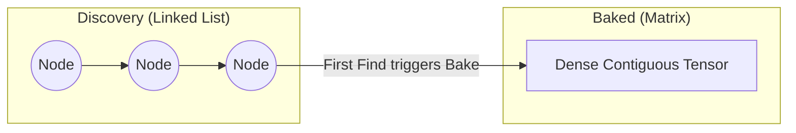
## EN
Static initialization gives us free discovery, but walking a linked list for 100k entities is performance suicide. The Bake solves this: the first time Find() is called, the list is flattened into a dense, contiguous matrix. Lookup becomes a calculation, not a search. We trade dynamic flexibility for static performance.
## FR
L'initialisation statique nous a offert la découverte gratuite. Mais maintenant on est dans le hot path. Cent mille entités, chacune ayant besoin de trouver son comportement à chaque frame. Parcourir une liste chaînée, c'est sauter de pointeur en pointeur — chaque saut est un potentiel cache miss. Faites le calcul : quarante-huit millions de déréférencements par seconde. Le Bake résout ça. La première fois que Find() est appelé, un StaticGuard le déclenche automatiquement. La liste est aplatie en une matrice dense et contiguë. À partir de ce moment, la recherche devient un calcul. On a échangé la flexibilité de l'enregistrement dynamique contre la performance d'un layout statique.

# SLIDE: 04 - THE OPAQUE TRANSPORT (ModelShell)
## Code
```cpp
class ModelShell {
    struct Concept { virtual ModelTypeID GetID() const = 0; };
    template<class T> struct Model : Concept { T value; };
    alignas(64) std::byte m_SBO[64]; // SBO, Zero heap
public:
    template<class T> const T& Get() const {
        return static_cast<const Model<T>*>(m_ptr)->value;
    }
};
```
## Mermaid
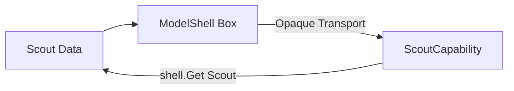
## EN
ModelShell is a logic-empty shell that carries data and preserves identity across boundaries. The only job is data transport. It uses Small Buffer Optimization (SBO) to ensure zero heap allocation and fits within a cache line. The data recovery via Get<T>() only happens inside the behavior that knows the type.
## FR
Le seul rôle du shell était de transporter la donnée et de préserver l'identité à travers les frontières. J'ai donc gardé la coquille — le shell — et j'ai tout le reste jeté. Le Concept est minimal : une seule méthode virtuelle, GetID(). C'est tout. Pas d'Execute, pas de logique. La seule API publique est Get<T>() — un static_cast pour récupérer la donnée typée. Et ce cast n'existe qu'à l'intérieur du comportement enregistré pour ce type. Le shell traverse toutes les frontières de manière opaque. En production, il vit dans un buffer aligné sur la stack (SBO). Zéro allocation heap. Si vous avez besoin de vérifier : sizeof(ModelShell) tient dans une ligne de cache.

# SLIDE: 05 - THE VIRTUAL DEADLOCK (Breaking the Lock)
## Code
```cpp
// THE PROBLEM: Virtual + Template = Illegal
struct IShape {
    template<class T> virtual T Get() = 0; // compiler error
};

// THE BREAK: Split concerns
struct Concept {
    virtual ModelTypeID GetID() const = 0; // Identity
};
template<class T>
const T& Get() const { ... } // Template Data Recovery
```
## Mermaid
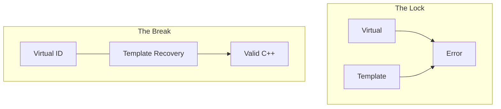
## EN
C++ forbids virtual template methods — the 'Virtual Deadlock'. ModelShell breaks this by splitting the concerns: one virtual method (GetID()) for identity, and a non-virtual template method (Get<T>()) for data recovery. One virtual jump to identify, one static_cast to recover. The lock is broken.
## FR
Vous voulez appeler une méthode templatisée sur une collection hétérogène derrière un pointeur. Vous écrivez donc une méthode virtuelle template sur l'interface. Le compilateur dit non. Virtuel et template sont mutuellement exclusifs en C++. Le ModelShell casse ce verrou en séparant les deux responsabilités. Le Concept expose une seule méthode virtuelle — GetID() — non-template, pour l'identité uniquement. Get<T>() vit sur le shell lui-même, non-virtuel, en tant que template. Un seul saut virtuel pour identifier le type, un static_cast direct pour récupérer la donnée. Le verrou est cassé.

# SLIDE: 06 - IDENTITY DECOUPLING (The Capability Binding)
## Code
```cpp
// DATA: scout.h (Pure state)
struct Scout { string callsign; int health; };

// LOGIC: diag.cpp (Pure logic)
struct Diagnostic : IDiagnostic {
    void Execute(const ModelShell& shell) const { ... }
};

// BINDING: wire.cpp (The wire)
static const CapabilityBinding<Scout, Diagnostic> g_ScoutDiag;
```
## Mermaid
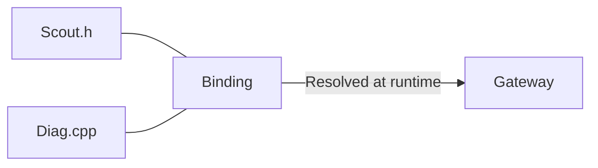
## EN
Data, Logic, and Binding are orthogonal dimensions that never include each other. The Gateway resolves them at runtime through the baked matrix. You can add a new capability by dropping a new .cpp file with a static binding. We compose systems at link time, not at compile time.
## FR
Maintenant on a les trois pièces. La donnée vit dans scout.h — état pur, aucune dépendance. La logique vit dans DiagnosticCapability. Et le binding est un simple statique qui relie les deux. Ces trois fichiers ne s'incluent jamais mutuellement. Le Gateway effectue le routage au runtime à travers la matrice baked. Vous pouvez ajouter une capability pour Scout en déposant un nouveau .cpp sans toucher au reste. C'est ce qui tue le Build Wall. Donnée, Logique et Binding sont trois dimensions orthogonales. On les compose au moment du link, pas à la compilation.

# SLIDE: 07 - THE OOP ILLUSION (Invoke / TryInvoke)
## Code
```cpp
// Cold Path: Clean OOP syntax
shell.Invoke<&IMovement::Move>(ctx);

// Analyzed at compile-time:
// 1. Extracts Interface (IMovement)
// 2. Validates signature
// 3. One virtual jump + O(1) tensor
// 4. Direct call
```
## Mermaid
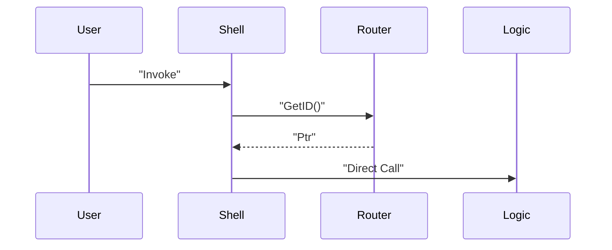
## EN
Invoke and TryInvoke provide an OOP illusion for the cold path. The method pointer is analyzed at compile time to extract the interface and validate the signature. It pays one virtual call to recover the type, then jumps into the tensor. Use it for queries, never in a hot loop.
## FR
Le pointeur de méthode que vous passez est analysé par ModelShellMethodTraits à la compilation. Il en extrait l'interface — vous ne la nommez jamais explicitement. Invoke assume le succès. TryInvoke est la version défensive : si le shell est invalide ou l'interface non trouvée, il retourne un Optional vide. La première règle : Invoke et TryInvoke sont votre API pour le cold path. Outils, UI, requêtes de debug. Le moment où vous mettez Invoke dans une boucle sur dix mille entités, vous payez un appel virtuel par itération. Ce n'est pas l'usage prévu.

# SLIDE: 08 - THE BAKER (One Line, N Models)
## Code
```cpp
using AirModels = TypeList<Scout, Drone, Heavy>;

// One line. All models. All capabilities.
static const CapabilityBaker<AirModels, Diag, Tele> g_AirBaker;
```
## Mermaid
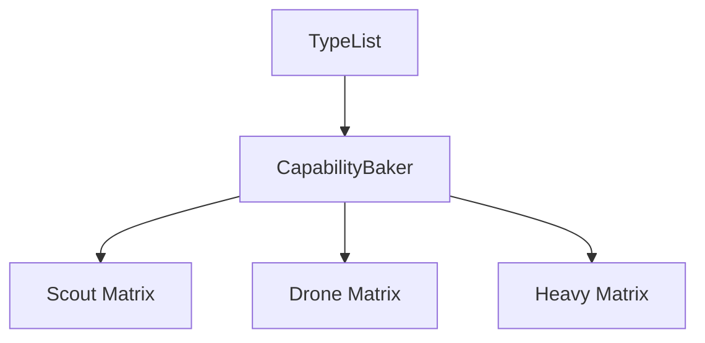
## EN
Manual registration doesn't scale. The Baker fixes this by expanding a TypeList of models across templatized capabilities. One static line generates N entries in the matrix. Group definitions by domain and let the matrix build itself.
## FR
L'enregistrement manuel ne passe pas à l'échelle. Ajoutez un modèle : deux lignes de plus. Ajoutez une capability : trois lignes de plus. Le Baker résout ça. DiagCapability devient un template sur TModel. Ensuite, une seule ligne CapabilityBaker expand la TypeList. Trois modèles, deux capabilities : un seul statique, six entrées dans la matrice. Et la décentralisation est préservée. Ajoutez un modèle à la TypeList ? Chaque capability se propage. Ajoutez une capability ? Chaque modèle en bénéficie. La matrice se construit seule.

# SLIDE: 09 - THE PRICE OF FREEDOM (O(N) Search)
## Code
```cpp
// Current Find() bottleneck:
for (const auto* node : RouterSlot::s_Value) {
    if (node->GetID() == modelID) // comparison
        return node->Resolve(iid);
}
```
## Mermaid
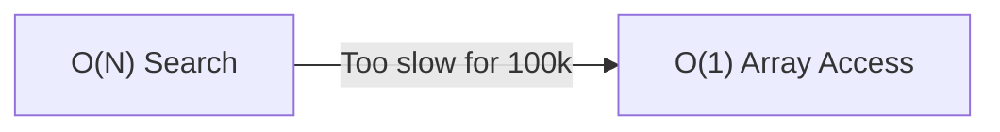
## EN
The Baker is elegant, but Find() is still O(N) over the number of registered models. For 100k entities, this is a bottleneck. We need pure math: compute an offset and jump. But hashes can't be array indices. We need to collapse the sparse ID universe.
## FR
Le Baker est élégant. Mais regardons ce que Find() fait réellement. Il itère sur les nœuds de modèles enregistrés, compare les IDs, résout l'interface. C'est O(N) sur le nombre de modèles enregistrés. Pour trois cents modèles à cent mille entités par frame — c'est un goulot d'étranglement. L'objectif c'est ça : un calcul, zéro recherche. Donné un modelID et un contexte, calculer un offset mémoire et sauter directement. Mais il y a un problème. Notre modelID est un hash — une valeur size_t aléatoire. Ça ne peut pas servir d'index de tableau.

# SLIDE: 10 - THE ID EXPLOSION (The Sparse Universe)
## Code
```cpp
// typeid().hash_code() is sparse (0 to 4B)
// Scout -> 0x4A1F...
// Drone -> 0x9B3D...

// THE COLLAPSE: DenseTypeID
template<class T>
struct DenseTypeID {
    static DenseID Get() {
        static DenseID s_id = Counter++; // 0, 1, 2...
        return s_id;
    }
};
```
## Mermaid
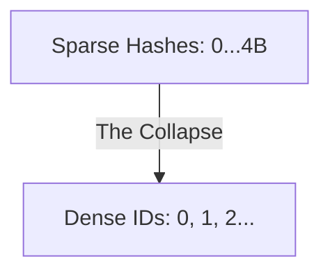
## EN
ModelTypeIDs are arbitrary hashes scattered across a 4-billion slot space. You can't index an array with them. DenseTypeID collapses this sparse universe into consecutive integers (0, 1, 2...) assigned at startup. Now lookup is one array access.
## FR
Nos ModelTypeIDs viennent de typeid().hash_code(). Scout hash à un virgule deux milliards. Ce sont des valeurs size_t arbitraires éparpillées sur un spectre de quatre milliards de slots. Si j'essaie de les utiliser comme index, ma table a besoin de seize gigaoctets juste pour des pointeurs. Le seul chemin vers un accès direct O(1) est de réduire cet espace épars en entiers consécutifs. Zéro, un, deux, trois. C'est DenseTypeID. Chaque type obtient un local statique qui incrémente un compteur global une seule fois. Maintenant s_CapabilityTensor[0] c'est la capability de Scout. Un accès tableau. Une instruction.

# SLIDE: 11 - THE DENSE INDEXER (Collapse in Action)
## Code
```cpp
// THE FLAT TENSOR: Rows = DenseID, Columns = Offset
static vector<vector<RouteNode*>> s_Tensor;

// Lookup: two array accesses
return s_Tensor[denseID][offset];
```
## Mermaid
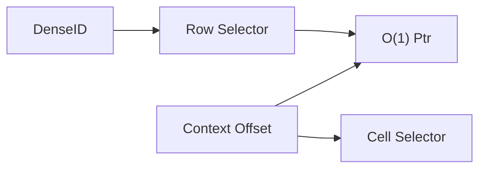
## EN
DenseID is thread-safe (C++11 static local) and assigned exactly once per type. We build a flat tensor where rows are DenseIDs and columns are context offsets. No loop, no comparison, no hash collision. Finding a capability is now just a question of 'what is the offset?'.
## FR
DenseTypeID est d'une simplicité désarmante. Le standard C++11 garantit que c'est thread-safe. Pas de mutex, zéro cérémonie. Maintenant on peut construire le CapabilityTensor. L'index extérieur c'est le DenseID, l'index intérieur c'est l'offset de contexte. Le lookup c'est deux accès tableau. Pas de boucle, pas de comparaison, pas de collision. C'est le moment où la recherche disparaît. Trouver une capability n'est plus une question de 'où est-elle ?' — c'est une question de 'quel est l'offset ?' Et ça, c'est du pur calcul.

# SLIDE: 12 - THE HYPERCUBE (N-Dimensional Space)
## Code
```cpp
// Horner's Method: Resolve N-dims into 1 offset
// offset = (State * Zone_count) + Zone
template<class... TAxes>
struct Space {
    static constexpr size_t Volume = (EnumTraits<TAxes>::Count * ...);
    static size_t ComputeOffset(Args... args) { ... }
};
```
## Mermaid
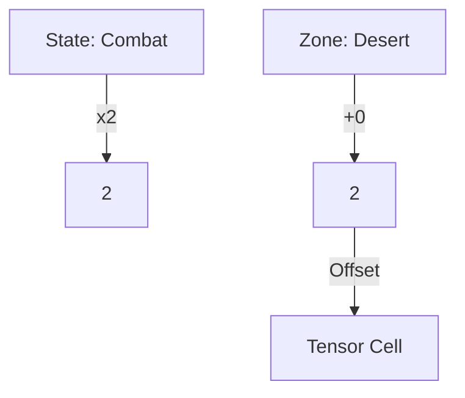
## EN
A behavior depends on context axes: State, Zone, Authority. Space encodes these at compile time. ComputeOffset uses Horner's method — one accumulation, no branches. Whether you have one dimension or ten, the lookup cost stays flat: two array accesses. Complexity is free.
## FR
Un comportement ne dépend pas seulement de ce qu'est l'entité. Il dépend de où elle est, quand elle est, qui la contrôle. State. Zone. Authority. Ce sont vos axes de contexte. Space encode les axes à la compilation. ComputeOffset utilise la méthode de Horner — une boucle d'accumulation, pas de branches, pas de divisions. Un seul nombre. Maintenant le lookup c'est deux nombres. Deux accès tableau. Le CPU calcule les deux dans le même cycle. Et le plus beau ? Chaque axe que vous ajoutez multiplie le Volume — mais le coût du lookup reste absolument identique. Une dimension ou dix, ce sont toujours les mêmes deux accès tableau. La complexité est gratuite.

# SLIDE: 13 - THE CRG CURE (Immutable Topology)
## Code
```cpp
// MUTABLE: Behavior change = structural rewire
behaviors.remove(entity, patrol); // prefetcher loses stream

// CRG: Behavior change = coordinate update
world_state = State::Combat; // matrix: unchanged.
```
## Mermaid
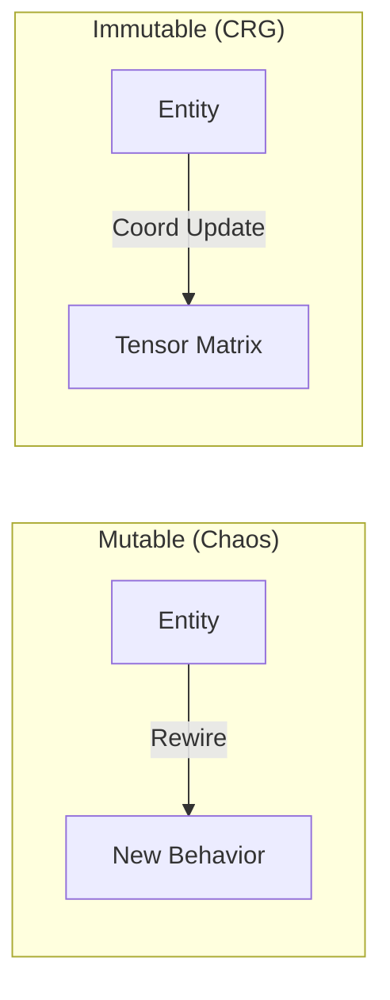
## EN
In a mutable topology, behavior changes are structural operations that break the CPU prefetcher. In CRG, the matrix is frozen. A behavior transition is just a coordinate update. The memory addresses never change, so the prefetcher never loses its stream. Immutability is a performance guarantee.
## FR
L'Acte II nous a donné un tenseur. Une matrice plate et contiguë de pointeurs de comportements, indexée par le modèle et le contexte. Construite une fois, jamais retouchée. Cette immutabilité n'est pas un accident — c'est la garantie centrale. Dans une topologie mutable, chaque changement de comportement est une opération structurelle. On ajoute, on retire, on recâble. Le layout mémoire change. Le prefetcher avait fait une prédiction. Maintenant, elle est fausse. Vous payez une pénalité de cache à chaque transition — pas pour une raison logique, mais purement structurelle. Avec le CRG, la matrice ne change jamais. Une transition de comportement n'est qu'une mise à jour de coordonnées. world_state bascule en Combat. Au lookup suivant, le tenseur renvoie un pointeur différent. La matrice n'a pas bougé. Les adresses mémoire n'ont pas changé. Le prefetcher a gardé son flux. L'immutabilité n'est pas une contrainte. C'est une garantie de performance. Et c'est ce qui nous permet d'atteindre la limite matérielle.

# SLIDE: 14 - ECS SYMBIOSIS (The Brain & The Muscle)
## Code
```cpp
// THE BRAIN (5 Hz): Decision
cap = Router::Find<Energy>(handle, state, zone);

// THE MUSCLE (60 Hz): Execution
for (auto& [battery, cap] : ecs.View<ActiveCapability>()) {
    cap(params); // Direct static call
}
```
## Mermaid
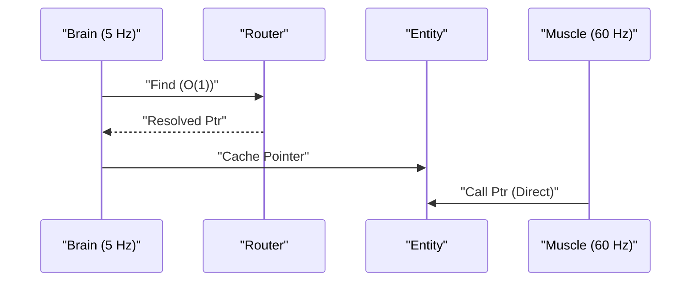
## EN
ECS manages the data pipeline (Muscle); CRG manages logic projection (Brain). The Brain ticks at 5Hz, makes the decision via O(1) lookup, and caches it in ActiveCapability. The Muscle ticks at 60fps, iterating packed arrays and calling the pointer directly. We are bottlenecked by RAM, not logic.
## FR
C'est ici qu'on parle de symbiose, pas de remplacement. L'ECS possède le pipeline de données : les entités sont des structures pures packées dans des tableaux contigus. Le prefetcher est ravi. Le CRG possède la projection logique : il sait quel comportement appliquer selon le contexte (état, zone, etc.). Le passage de témoin se fait via le composant ActiveCapability. Le système "Cerveau" tourne à 5Hz. Il appelle le Router pour un lookup O(1) et cache le résultat. Le système "Muscle" tourne à 60Hz. Il itère sur les tableaux et appelle directement le pointeur. Pas de virtuel, pas de recherche. La partie coûteuse est rare, la partie gratuite est constante. On n'est plus limité par la logique, mais par la RAM.

# SLIDE: 15 - THREE LEVELS (The Performance Ladder)
## Code
```cpp
// Level 1: Classic OOP vtable       -> ~20.0 ns
entity.GetBehavior()->Update();

// Level 2: CRG Shell (Cold Path)    ->  ~7.0 ns
shell.Invoke<&IMovement::Move>();

// Level 3: ActiveCapability (DOD)   ->  ~1.5 ns
cap(params); // Zero virtual. Direct ptr.
```
## Mermaid
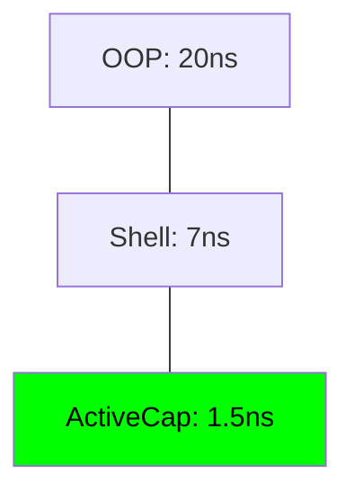
## EN
Three levels of speed. Level 1: classic OOP vtable dispatch (~20ns). Level 2: CRG Shell Invoke, paying a virtual jump for type erasure (~7ns) — perfect for cold paths. Level 3: ActiveCapability, cached results called directly via function pointer (1.5ns). We've reached the physical hardware limit.
## FR
Trois niveaux de vitesse. Niveau 1 : le dispatch classique par vtable OOP (~20ns). Niveau 2 : ModelShell Invoke, payant un saut virtuel pour l'effacement de type (~7ns) — idéal pour les chemins froids. Niveau 3 : ActiveCapability, résultat mis en cache et appelé directement via pointeur de fonction (1.5ns). Nous avons atteint la limite physique du matériel.

# SLIDE: 16 - REACHING THE SILICON LIMIT (Benchmarks)
## Code
```cpp
// Throughput at Scale (1M entities)
// Classic ECS (10% Mutation): 19.26 Gi/s
// CRG Projection: 30.83 Gi/s
```
## Mermaid
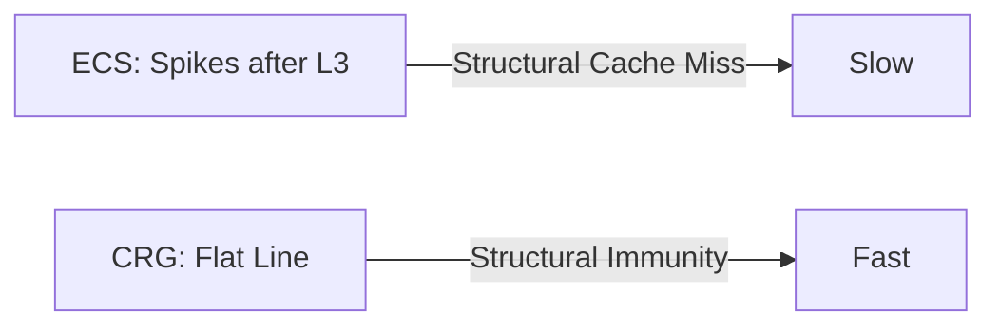
## EN
This is the physical reality of the Memory Wall. At a 10% mutation rate, traditional ECS architectures drop to 19 Gi/s because the CPU is busy moving memory instead of executing logic. CRG sustains over 30 Gi/s because the topology is immutable. Note the QR code on the right: you can scan it now to access the live simulator and verify these performance metrics on your own device during the Q&A.
## FR
C'est ici que l'on frappe le "Memory Wall". À 10% de mutation, l'ECS classique chute à 19 Go/s car le CPU passe son temps à déplacer de la mémoire plutôt qu'à exécuter de la logique. Le CRG maintient plus de 30 Go/s car la topologie est immuable. Notez le QR code à droite : vous pouvez le scanner dès maintenant pour accéder au simulateur live et vérifier ces mesures de performance sur votre propre appareil.

# SLIDE: 17 - STRESS TEST SIMULATION (High Volatility)
## Code
```cpp
// Visualizing the Memory Wall
// Scenario: 50k Entities, Dynamic Mutation (0% -> 46%)
// Red: ECS Archetype Migration | Green: CRG Static Tensor
```
## Mermaid
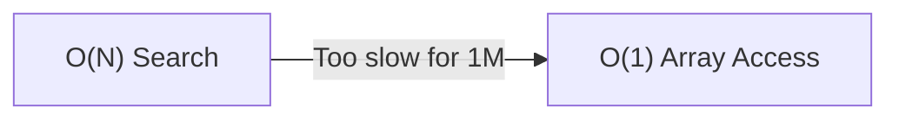
## EN
In this visual stress test at 50,000 entities, you can see the ECS frame-time (in red) skyrocketing as soon as we introduce behavioral volatility. Every archetype change is a memory copy that destroys cache locality. The green line represents CRG: it remains a flat line because it treats transitions as coordinate updates, not structural rewires. Feel free to use the simulator link to adjust the mutation rate yourself.
## FR
Dans ce stress-test visuel à 50 000 entités, vous voyez le frame-time de l'ECS (en rouge) s'envoler dès que l'on introduit de la volatilité. Chaque changement d'archétype est une copie mémoire qui détruit la localité du cache. La ligne verte, c'est le CRG : elle reste plate car il traite les transitions comme des mises à jour de coordonnées, pas des recâblages structurels. N'hésitez pas à utiliser le lien du simulateur pour ajuster le taux de mutation vous-même.

# SLIDE: 18 - CONCLUSION
## Code
```cpp
// 1. Zero Coupling  (Linker)
// 2. Zero Search    (Math)
// 3. Zero Migration (Hardware)

// CRG is what happens when you 
// stop fighting C++.
```
## Mermaid
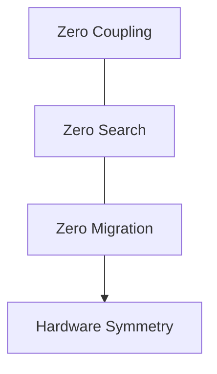
## EN
CRG is a linker-driven dispatch framework for any C++ system needing decoupling and performance. Three guarantees: Zero coupling (modules self-register), Zero search (context is a coordinate), Zero migration (topology is immutable). Stop fighting C++ and the hardware. Give them what they were built for.
## FR
Le CRG est un framework de dispatch piloté par le linker pour tout système C++ exigeant découplage et performance. Trois garanties : Zéro couplage (auto-enregistrement), Zéro recherche (coordonnées mathématiques), Zéro migration (topologie immuable). Arrêtez de vous battre contre le C++ et le matériel. Donnez-leur ce pour quoi ils ont été conçus.