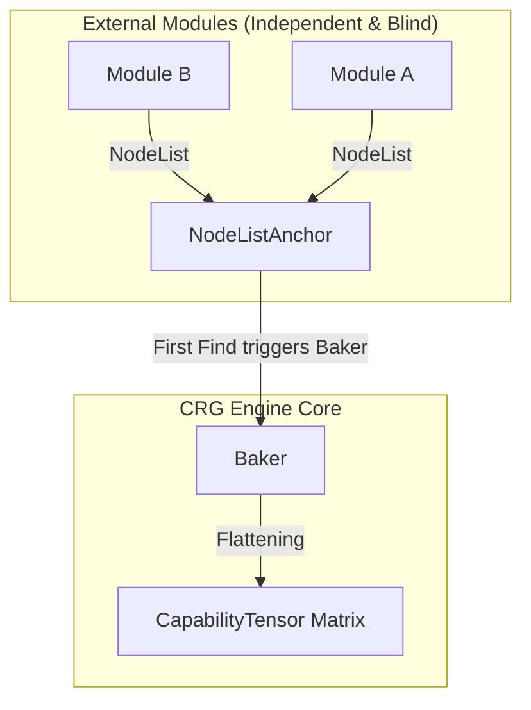
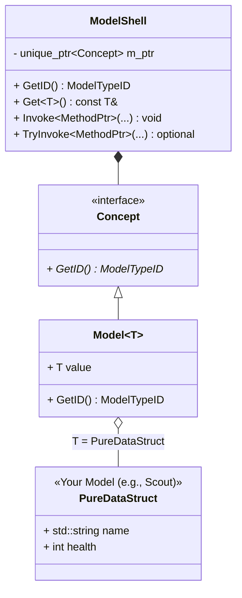
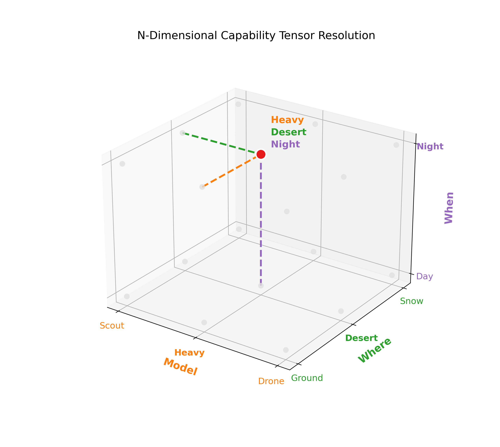
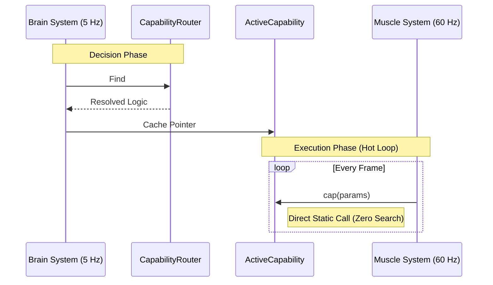
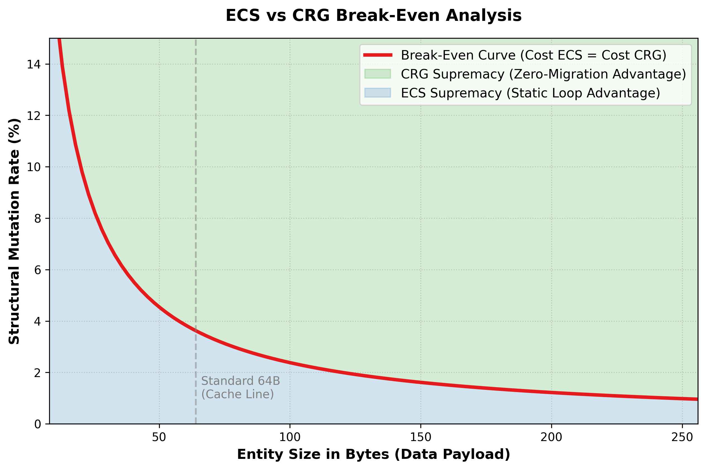

# CRG: Linker-Driven Discovery and Hardware-Bound Logic Mapping

### An Architecture for Universal Decoupling and Zero-Cost Behavior Projection

**Cyril Tissier** | April 2026

---

## 1. Abstract

The **Capability Routing Gateway (CRG)** is a general-purpose architectural pattern designed to resolve the fundamental conflict between modular decoupling and hardware efficiency. By treating data and logic as two parallel dimensions—mirroring the L1I/L1D split of modern CPUs—CRG eliminates the "Virtual Deadlock" inherent in traditional object-oriented hierarchies. It provides a linker-driven, zero-allocation framework for any C++ system requiring decoupled module discovery and high-performance behavior projection, from plugin-based tools to massive scale simulations.

CRG delivers three uncompromising guarantees: **Zero Coupling, Zero Search, and Zero Migration**.

---

## 2. Pillar I: Linker-Driven Discovery (Universal Decoupling)

CRG relocates Inversion of Control (IoC) to the linker level to eliminate the build-time bottlenecks of centralized registries.

* **Zero-Include Registration:** Modules self-register via a `NodeList` pattern. A feature or plugin is added to the system simply by linking its binary, with zero modifications required to core headers or source code.
* **Linker-Resolved Plugins:** This architecture provides a fully functional plugin system as a side effect. Define a struct, instantiate it as a static—the OS wires the capability before `main()`, and the gateway discovers it only when requested, without the core ever needing to know the module exists.

---

## 3. Pillar II: Thematic Identity Governance (TypeList & DenseModelID)

CRG partitions identity through `TypeList` groupings to maintain data density and execution predictability.

* **The Collapse:** The architecture collapses the sparse, unpredictable universe of `typeid` hashes into a dense, contiguous array index via `DenseModelID`. This ensures that the behavioral tensor remains a tight, direct-access matrix.
* **Domain Isolation:** Distinct domains operate in isolated index spaces, preventing behavioral tables from becoming sparse even in systems with hundreds of independent modules.

---

## 4. Pillar III: The ModelShell (Breaking the Virtual Deadlock)

The **ModelShell** is the vehicle for high-performance data transport across decoupled systems. Inspired by Klaus Iglberger’s Type Erasure, it is a "shell" stripped of all behavioral logic.

* **Identity without Logic:** The shell carries only data and identity. It breaks the "Virtual Deadlock" where C++ forbids virtual template methods. One virtual jump identifies the type; one static_cast recovers the data.
* **Hardware Symmetry:** By using Small Buffer Optimization (SBO) and cache-line alignment, the `ModelShell` ensures that data transport mirrors the physical requirements of the CPU prefetcher.
* **The OOP Illusion:** In the cold path, `ModelShell` provides `Invoke` and `TryInvoke` APIs. These analyze method pointers at compile-time to resolve interfaces automatically, offering a clean OOP syntax without the architectural tax.

---

## 5. Pillar IV: N-Dimensional Behavioral Projection

Behavioral resolution is modeled as a coordinate lookup within an **N-Dimensional Tensor** (CapabilitySpace).

* **Pure Arithmetic Dispatch:** Contextual axes (State, Zone, Authority) are resolved via Horner’s method into a flat offset. Complexity is free: whether you have one or ten dimensions, the lookup remains two array accesses.
* **Immutable Topology:** Behavior transitions are coordinate updates, not structural rewirings. The memory addresses of the logic never shift, allowing the prefetcher to maintain a perfect stream.

---

## 6. Pillar V: ECS Symbiosis (Brain & Muscle)

When applied to ECS architectures, CRG decouples the "Decision" (Logic Projection) from the "Execution" (Data Pipeline).

* **The Brain (Decision):** A low-frequency system evaluates the context and performs the O(1) tensor lookup. The result is cached inside the entity using an `ActiveCapability` component.
* **The Muscle (Execution):** A high-frequency system iterates contiguous arrays and calls the cached result directly via function pointer. 
* **Bulletproof Contracts:** The `ActiveCapability` uses strict SFINAE (IsDODContract) to ensure that high-performance static dispatch cannot be accidentally confused with polymorphic OOP interfaces.

---

## 7. Performance & Benchmarks

CRG reaches the hardware limit by ensuring **Structural Immunity**: data never moves to change its behavior.

* **Level 1 (OOP / vtable):** ~20 ns/entity.
* **Level 2 (ModelShell Invoke):** ~7 ns/entity (Cold path routing).
* **Level 3 (ActiveCapability):** Zero-overhead static dispatch. The only cost is a pure C-style function pointer jump.

By avoiding memory fragmentation and cache-thrashing `Swap & Pop` operations during behavioral shifts, CRG effectively doubles memory throughput in volatile environments. The following benchmark compares a traditional ECS to CRG under a **10% structural mutation rate** (where 10% of entities change their behavior state per frame):

| Dataset Size          | Implementation     | Throughput     | Overhead vs CRG |
| :-------------------- | :----------------- | :------------- | :-------------- |
| **64k (Cache-bound)** | ECS (10% mutation) | 35.23 Gi/s     | **1.99x**       |
|                       | **CRG Projection** | **70.23 Gi/s** | **Baseline**    |
| **1M (Memory-bound)** | ECS (10% mutation) | 19.26 Gi/s     | **1.60x**       |
|                       | **CRG Projection** | **30.83 Gi/s** | **Baseline**    |

---

## 8. Architectural Decision Matrix (ECS vs CRG)

CRG does not deprecate ECS; it complements it. The architectural decision between traditional ECS archetype migration and CRG pointer caching depends on two variables: **Entity Size** (Data Payload) and **Structural Mutation Rate** (State Volatility).

* **ECS Supremacy (Static Loops & Micro-Entities):** For data payloads strictly under 32-bytes exhibiting highly static behavior (< 4% mutation rate), ECS archetype processing is mathematically optimal. The occasional `memcpy` penalty is offset by zero-indirection loops.
* **CRG Supremacy (Zero-Migration & Heavy Logic):** Once an entity exceeds the 64-byte L1 cache-line threshold, or if state volatility exceeds 4%, the memory-wall constraints dominate CPU performance. By caching a `DODDescriptor` rather than migrating data structures, CRG preserves prefetcher momentum and linear memory access, effectively decoupling logical state from physical memory location.

---

## 9. FAQ

**Q: Is CRG only for Game Engines?**
No. It is for any C++ system where modules must remain completely independent. It allows a module to "exist" and be discovered by the system without the module ever needing to know the system's internals, and vice versa.

**Q: What is the "Virtual Deadlock"?**
The impossibility in C++ to have a virtual template method. `ModelShell` resolves this by splitting identity (virtual) from data recovery (template).

**Q: How does it handle Hot-Reload?**
Live++ patches function bodies in place. For topology changes, the developer triggers a `Bake` to rebuild the tensor matrix from the linked list of nodes.

---

**Author:** Cyril Tissier  
**License:** Apache 2.0  

**Legal Disclaimer:** *This repository represents independent research and a clean-room implementation of the Capability Routing Gateway architecture. All code and documentation were developed personally by the author. This project is independent of, and does not contain any proprietary or confidential information from, any past or present employer.*