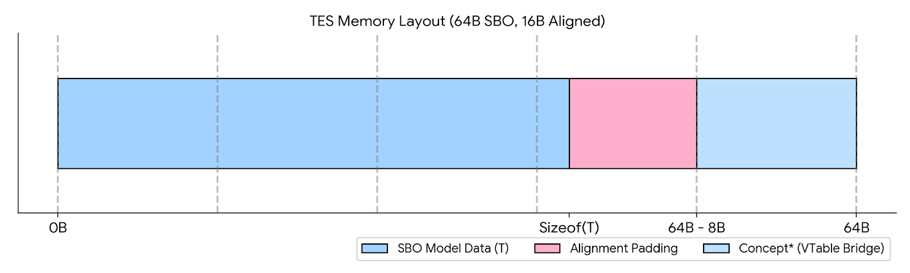

# CRG: Linker-Driven Discovery and Hardware-Bound Logic Mapping
### An Architecture for Modular Decoupling and High-Performance Dispatch

**Cyril Tissier** | April 2026

---

## 1. Abstract
The **Capability Routing Gateway (CRG)** is an architectural framework developed to resolve two divergent constraints in AAA development: the need for total module decoupling (Team Scalability) and the requirement for hardware-level execution efficiency (Performance). By shifting module discovery to the linker level through a **Linker-Driven Discovery** pattern, CRG removes centralized dependency bottlenecks. When applied to entity logic, it enables a deterministic $O(1)$ dispatch that saturates system memory bandwidth at **30.83 Gi/s** while maintaining 100% data residency.

---

## 2. Pillar I: Linker-Driven Discovery (The Core Innovation)
The primary bottleneck in large-scale C++ projects is often the "Central Registry" pattern, which forces every module to know about every other module. CRG relocates Inversion of Control (IoC) to the linker.

* **Zero-Include Registration:** Behavior modules (DLLs/Plugins) interface with the Gateway via a **Linker-Driven Registry**. This allows a feature to be added to the engine simply by linking its binary, with no modifications required to the core engine headers or source code.
* **The Strict Anchor Pattern:** To prevent dead-code stripping, CRG employs a **Strict Anchor** specialization in the core. This forces the linker to resolve and "pull" behavior chains across binary boundaries, ensuring all capabilities are "baked" into the engine's routing matrix during a controlled startup sequence.

---

## 3. Pillar II: Thematic Identity Governance (`TFamily`)
CRG partitions identity through `TFamily` layers to maintain data density and cache efficiency.

* **Domain Isolation:** Distinct domains (e.g., `RobotFamily`, `VFXFamily`) operate in isolated index spaces. This ensures that behavioral tensors remain dense, preventing the "Sparse Table" problem common in monolithic ID systems.
* **Type-Safe Phantom IDs:** Strong typing (`DenseModelID`, `DenseInterfaceID`) prevents cross-domain ID leakage and ensures compile-time safety for domain-specific interfaces.

---

## 4. Pillar III: The Type-Erased Shell (TES)
The **ModelHandle** acts as a **Type-Erased Shell (TES)** designed for high-performance data transport across decoupled systems.

* **SBO & Cache-Line Alignment:** To avoid heap fragmentation, the TES utilizes **Small Buffer Optimization (SBO)** with `alignas(64)` constraints. This ensures that any data projection starts at a hardware cache-line boundary, optimizing prefetcher efficiency.
* **Concept/Model Abstraction:** TES encapsulates concrete types while providing the Gateway with a localized **Reverse Router**, enabling $O(1)$ capability resolution without call-site knowledge of the underlying type.

*Figure 1: TES memory layout illustrating SBO buffer, alignment padding, and the Concept pointer bridge.*

---

## 5. Pillar IV: N-Dimensional Behavioral Projection
For systems requiring high-frequency updates, CRG models behavioral resolution as a coordinate lookup within an **N-Dimensional Tensor**.

* **Amortized Resolution:** Capability lookup is a deterministic calculation: `(ModelID * Volume) + Offset`. 
* **Branch-Predictor Friendly:** Contextual logic (Environment, State, Time) is resolved into a flat $O(1)$ access using **Horner’s method**, removing the need for complex branching or state-machine logic in hot loops.

*Figure 2: 3D Visualization of behavioral resolution at the intersection of Entity Model, Environment, and Time.*

---

## 6. Performance Analysis
CRG is designed to reach the physical limits of the hardware by ensuring **Structural Immunity**—the principle that data should never move or be copied to change its logical behavior.

| Entities | ECS Mutation (Throughput) | CRG Projection (Throughput) | Ratio |
| :--- | :--- | :--- | :--- |
| 65,536 | 35.23 Gi/s | **70.23 Gi/s** | **1.99x** |
| 1,048,576 | 19.26 Gi/s | **30.83 Gi/s** | **1.60x** |

**Technical Conclusion:** By eliminating "Archetype Migrations," CRG allows the CPU to operate at peak memory bandwidth, effectively reaching the **Memory Wall** limit.

---

## 7. Design Trade-offs & FAQ

**Q: Can I use the Discovery system without the Performance Tensors?**
Yes. Pillar I is a standalone solution for modularity. You can use CRG solely to decouple your engine's sub-systems and reduce compile times, even if those systems use traditional OOP or standard ECS logic.

**Q: Is there a hidden cost compared to a "Pure" ECS System?**
Yes. A pure ECS remains optimal for mass-simulations with low state complexity (e.g., particles). CRG introduces a **1.5ns dispatch tax** (approx. 4-6 cycles) per entity. This trade-off is specifically designed for complex gameplay entities, where the constant-time dispatch offsets the unpredictable performance spikes of traditional Archetype Migrations.

**Q: Can this be integrated into existing engines?**
Yes. CRG supports **Hybrid Adoption**. Developers can wrap specific existing ECS modules within the CRG framework to leverage its interface governance without requiring a full engine rewrite.

**Q: Does CRG provide built-in security against cheating?**
CRG is **"Anti-Tamper Friendly"** by design. By centralizing behavior pointers into a dense, contiguous matrix, it allows for fast integrity checks (e.g., hashing) and increases the reverse-engineering cost for malicious actors compared to scattered VTables.

---

**Implementation Note:** *The provided source code is a **reference implementation** focused on architectural clarity and portability. To maintain a clean-room approach and ensure readability, certain low-level optimizations (such as manual SBO memory management or custom stack allocators) have been replaced by standard C++ constructs (e.g., `std::unique_ptr`). In a production AAA environment, these should be replaced by the hardware-aligned structures described in this paper.*

**Author:** Cyril Tissier  
**License:** Apache 2.0  

**Legal Disclaimer:** *This repository represents independent research and a clean-room implementation of the Capability Routing Gateway architecture. All code and documentation were developed personally by the author. This project is independent of, and does not contain any proprietary or confidential information from, any past or present employer.*